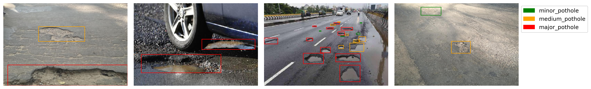
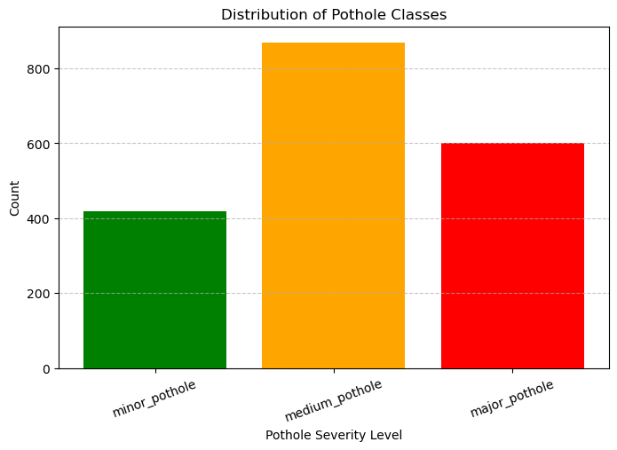

# Annotated Potholes Dataset with Severity Levels

  

## Overview
This dataset contains **717 images** of potholes and their corresponding **annotations**. The images are located under the `./images/` directory, and the annotations (in Pascal VOC XML format) are found under `./annotations/`.

## Annotation Details
Each annotated object in the dataset belongs to one of **three severity classes**, specified in the `<name>` field of the XML annotations:

- **minor_pothole**: Potholes classified as minor or non-threatening to both pedestrians and vehicles.
- **medium_pothole**: Potholes that pose a potential threat to pedestrians but are minor or non-threatening to vehicles.
- **major_pothole**: Potholes that present a significant risk to both pedestrians and vehicles.

  

## Dataset Origin & Enhancements
This dataset is **an enhanced version** of the original dataset available at:  
[https://www.kaggle.com/datasets/chitholian/annotated-potholes-dataset](https://www.kaggle.com/datasets/chitholian/annotated-potholes-dataset)

### Improvements & Unique Features
✅ **Severity Classification:** Manually categorized potholes into three severity levels for better risk assessment.  
✅ **Annotation Corrections:** Fixed missing or incorrect bounding boxes from the original dataset.  
✅ **Expanded Dataset:** Added **52 new images** along with their full annotations.  

The first **665 images and annotations** originate from the original dataset, while the additional **52 images** enhance the dataset by introducing more diverse pothole conditions and ensuring improved annotation accuracy.

## Usage
This dataset can be useful for:
- **Object detection models** for pothole detection.
- **Road infrastructure analysis** for identifying hazardous potholes.
- **Autonomous vehicle research** to improve road safety by detecting potential threats.

## Notes

- The severity classification for the initial **665** images was performed using a custom Python script.
- The new annotations and classifications for the **52** additional images, along with the correction of some previous faulty annotations, were completed using **labelImg**.
- Some images feature the same potholes captured from different angles, which may introduce potential data leakage and bias in evaluations. This issue is scheduled to be addressed in future updates to the dataset.

We hope this dataset helps in developing better pothole detection models and improving road safety! 🚀
